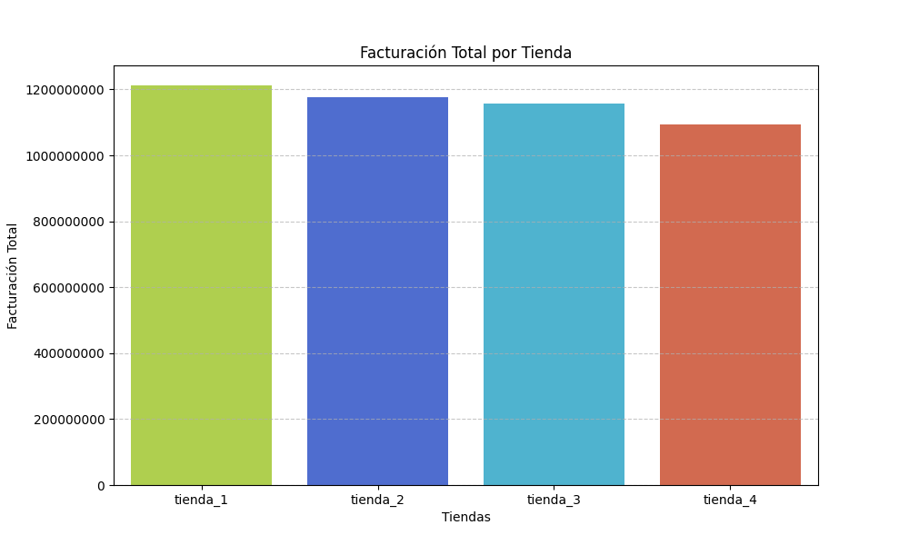
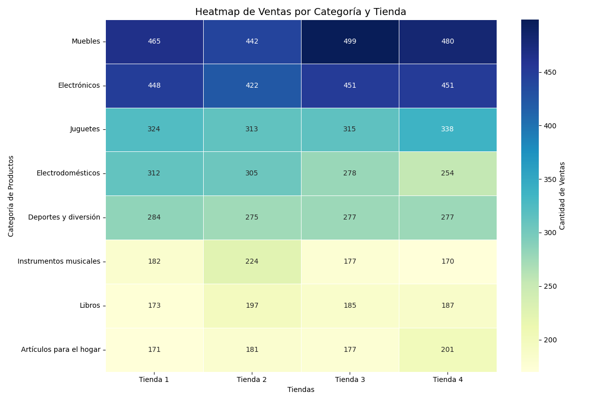
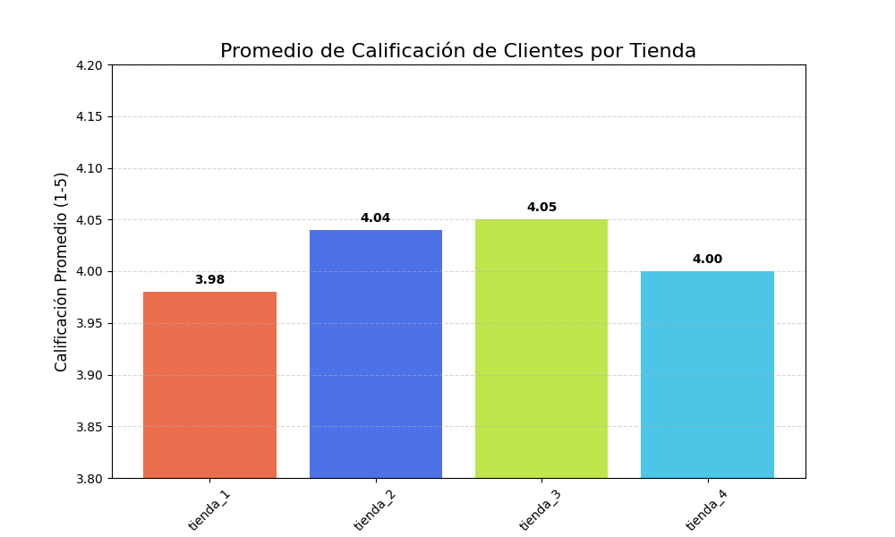
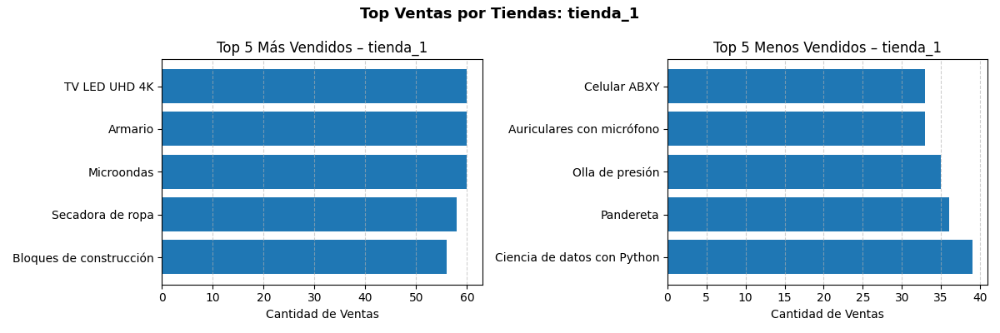
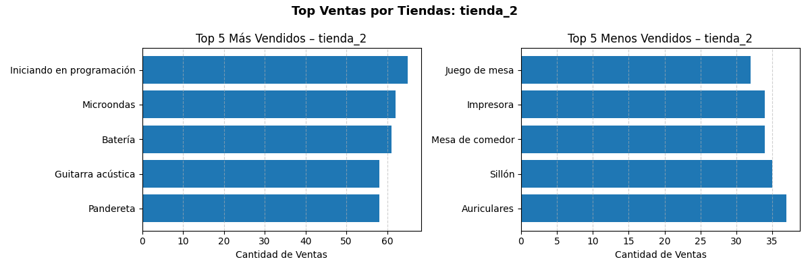
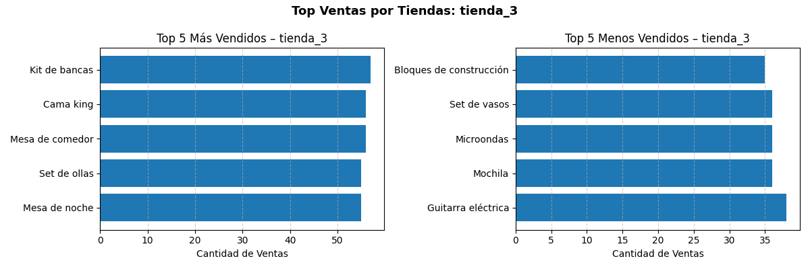
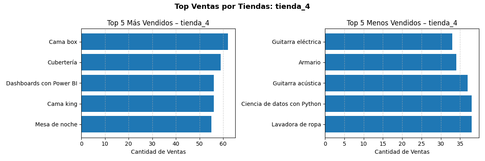

# Alura Store Latam – Challenge Alura - One 

## Descripción del proyecto

Este proyecto realiza un Análisis Exploratorio de Datos para el caso de estudio Alura Store Latam, con el objetivo de evaluar el desempeño de 4 tiendas a partir de sus ingresos, ventas por categorías de productos, calificaciones y costos de envío. El análisis permitirá identificar patrones clave y apoyar la toma de decisiones comerciales basadas en datos, así como recomendaciones de la venta de la tienda con menor productividad.

El trabajo se desarrolla en un Jupyter Notebook (AluraStoreLatam.ipynb) utilizando Python y librerías de análisis de datos.

## Objetivos

* Analizar la facturación total por tienda.

* Comparar las ventas por categoría de producto.

* Identificar los productos más y menos vendidos por tienda.

* Evaluar la calificación promedio de cada tienda.

* Analizar el costo de envío promedio.

* **Identificar insights clave para mejorar el rendimiento y brindar recomendaciones comerciales.** 

## Estructura del análisis

El notebook se organiza en las siguientes secciones, incorporando insights y hallazgos clave en cada etapa:

### Importación de datos

Carga de los datasets y verificación inicial de la información.

* Los datos presentan una estructura consistente entre tiendas, lo que permite comparaciones directas sin necesidad de transformaciones complejas iniciales.

### Análisis exploratorio de datos

* Revisión de valores nulos y duplicados.

* Validación de tipos de datos.

* Exploración general del dataset.

* Hallazgo clave: No se identificaron valores nulos ni registros duplicados, lo que indica una buena calidad de los datos y reduce el riesgo de sesgos en el análisis.

### Análisis de facturación

* Creación de la columna Precio Total.

* Comparación de ingresos entre las tiendas.

* **Resultados:**

    * Tienda 1: 1 212 258 300.00

    * Tienda 2: 1 175 828 600.00

    * Tienda 3: 1 156 536 200.00

    * Tienda 4: 1 093 693 100.00

* Resultados clave: La Tienda 1 lidera la facturación total del ecosistema, superando a la Tienda 4 en más de 118 millones, lo que evidencia una ventaja competitiva clara en volumen de ventas o ticket promedio.

**Gráfico de barras de facturación total por tienda**

 

### Ventas por categoría

* Identificación de categorías con mayor volumen de ventas.

* Comparación del desempeño por tienda.

* **Resultados (ventas totales):**

    * Muebles: 1,886 (categoría líder)

    * Electrónicos: 1,772

    * Juguetes: 1,290

    * Electrodomésticos: 1,149

    * Deportes y diversión: 1,113

    * Instrumentos musicales: 753

    * Libros: 742

    * Artículos para el hogar: 730 (menor volumen)

Resultados clave: Las categorías Muebles y Electrónicos concentran la mayor parte de la demanda, representando el núcleo del negocio. Las categorías con menor volumen podrían potenciarse mediante promociones o bundles.

**Heatmap de ventas por categoría y tienda**

### Calificación promedio de la tienda

* Evaluación de la satisfacción de los clientes.

* **Resultados numéricos:**

    * Tienda 1: 3.98

    * Tienda 2: 4.04

    * Tienda 3: 4.05 (mejor calificada)

    * Tienda 4: 4.00

Resultado clave: Aunque la Tienda 3 es la mejor valorada por los clientes, no es la líder en facturación, lo que sugiere una oportunidad para escalar ventas manteniendo la alta satisfacción.

**Gráfico de barras de calificación promedio por tienda**

### Productos más y menos vendidos

* Identificación de patrones de demanda.

* **Resultados destacados:**

    * Producto más vendido Tienda 1: TV LED UHD 4K (60 ventas)

    * Producto más vendido Tienda 2: Iniciando en programación (65 ventas)

    * Producto más vendido Tienda 3: Kit de bancas (57 ventas)

    * Producto más vendido Tienda 4: Cama box (62 ventas)

Insight clave: Los productos líderes varían por tienda, lo que confirma estrategias de catálogo diferenciadas.

**Tabla de Top 5 productos más y menos vendidos por tienda**

### Costo de envío promedio

* Análisis del impacto logístico en cada tienda.

* **Resultados:**

    * Tienda 1: 26,018.61

    * Tienda 2: 25,216.24

    * Tienda 3: 24,805.68

    * Tienda 4: 23,459.46 (menor costo)

* **Resultado clave:** La Tienda 4 presenta la mayor eficiencia logística. Optimizar costos de envío en otras tiendas podría mejorar márgenes y competitividad.

**Gráfico de barras del costo promedio de envío por tienda**

### Resultados destacados

* Los datos presentan alta calidad, sin valores nulos ni duplicados.

* Se identificó una tienda líder en facturación, mientras que otra presenta el menor rendimiento económico.

* Un conjunto reducido de categorías concentra la mayor proporción de ventas totales.

* Las calificaciones promedio muestran que la satisfacción del cliente no siempre está alineada con la facturación.

* Las diferencias en costos de envío evidencian oportunidades de optimización logística para mejorar la competitividad.

### Conclusiones

Aunque una tienda muestra menor rendimiento en facturación, el análisis integral muestra que ninguna tienda presenta un desempeño crítico que justifique su venta o cierre. Todas aportan valor al ecosistema de Alura Store, ya sea por facturación, satisfacción del cliente o eficiencia logística. Las diferencias observadas representan oportunidades de optimización, no señales de descarte.

### Tecnologías utilizadas

* Python 3

* Pandas – Manipulación y análisis de datos

* Matplotlib / Seaborn – Visualización de datos

* Jupyter Notebook – Desarrollo y documentación del análisis

### Notas

Este proyecto forma parte de un ejercicio académico/práctico orientado al aprendizaje de análisis de datos y visualización, aplicado a un caso de negocio realista.

**Autor: Lennin Billey Temoche Gómez**

